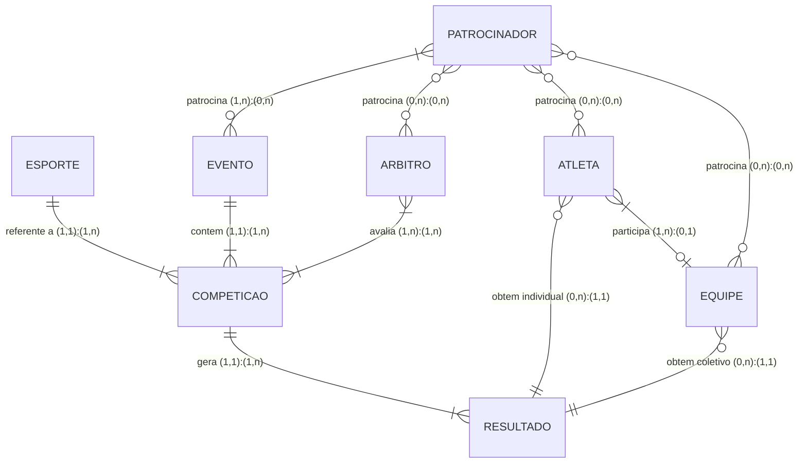

```mermaid
erDiagram
    ATLETA {
    }

    EQUIPE {
    }

    ESPORTE {
    }

    EVENTO {
    }

    COMPETICAO {
    }

    RESULTADO {
    }

    ARBITRO {
    }

    PATROCINADOR {
    }

    ESPORTE ||--|{ COMPETICAO : "referente a (1,1):(1,n)"

    EVENTO ||--|{ COMPETICAO : "contem (1,1):(1,n)"

    ARBITRO }|--|{ COMPETICAO : "avalia (1,n):(1,n)"

    COMPETICAO ||--|{ RESULTADO : "gera (1,1):(1,n)"

    ATLETA }|--o| EQUIPE : "participa (1,n):(0,1)"

    ATLETA o{--|| RESULTADO : "obtem individual (0,n):(1,1)"

    EQUIPE o{--|| RESULTADO : "obtem coletivo (0,n):(1,1)"

    PATROCINADOR }|--o{ EVENTO : "patrocina (1,n):(0,n)"

    PATROCINADOR o{--o{ ARBITRO : "patrocina (0,n):(0,n)"

    PATROCINADOR o{--o{ ATLETA : "patrocina (0,n):(0,n)"

    PATROCINADOR o{--o{ EQUIPE : "patrocina (0,n):(0,n)"
```