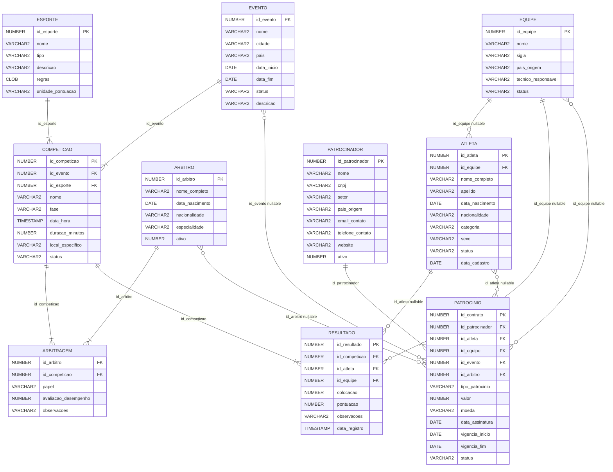

```mermaid
erDiagram

    ESPORTE {
        NUMBER id_esporte PK
        VARCHAR2 nome
        VARCHAR2 tipo
        VARCHAR2 descricao
        CLOB regras
        VARCHAR2 unidade_pontuacao
    }

    EVENTO {
        NUMBER id_evento PK
        VARCHAR2 nome
        VARCHAR2 cidade
        VARCHAR2 pais
        DATE data_inicio
        DATE data_fim
        VARCHAR2 status
        VARCHAR2 descricao
    }

    COMPETICAO {
        NUMBER id_competicao PK
        NUMBER id_evento FK
        NUMBER id_esporte FK
        VARCHAR2 nome
        VARCHAR2 fase
        TIMESTAMP data_hora
        NUMBER duracao_minutos
        VARCHAR2 local_especifico
        VARCHAR2 status
    }

    ARBITRO {
        NUMBER id_arbitro PK
        VARCHAR2 nome_completo
        DATE data_nascimento
        VARCHAR2 nacionalidade
        VARCHAR2 especialidade
        NUMBER ativo
    }

    ARBITRAGEM {
        NUMBER id_arbitro FK
        NUMBER id_competicao FK
        VARCHAR2 papel
        NUMBER avaliacao_desempenho
        VARCHAR2 observacoes
    }

    ATLETA {
        NUMBER id_atleta PK
        NUMBER id_equipe FK
        VARCHAR2 nome_completo
        VARCHAR2 apelido
        DATE data_nascimento
        VARCHAR2 nacionalidade
        VARCHAR2 categoria
        VARCHAR2 sexo
        VARCHAR2 status
        DATE data_cadastro
    }

    EQUIPE {
        NUMBER id_equipe PK
        VARCHAR2 nome
        VARCHAR2 sigla
        VARCHAR2 pais_origem
        VARCHAR2 tecnico_responsavel
        VARCHAR2 status
    }

    RESULTADO {
        NUMBER id_resultado PK
        NUMBER id_competicao FK
        NUMBER id_atleta FK
        NUMBER id_equipe FK
        NUMBER colocacao
        NUMBER pontuacao
        VARCHAR2 observacoes
        TIMESTAMP data_registro
    }

    PATROCINADOR {
        NUMBER id_patrocinador PK
        VARCHAR2 nome
        VARCHAR2 cnpj
        VARCHAR2 setor
        VARCHAR2 pais_origem
        VARCHAR2 email_contato
        VARCHAR2 telefone_contato
        VARCHAR2 website
        NUMBER ativo
    }

    PATROCINIO {
        NUMBER id_contrato PK
        NUMBER id_patrocinador FK
        NUMBER id_atleta FK
        NUMBER id_equipe FK
        NUMBER id_evento FK
        NUMBER id_arbitro FK
        VARCHAR2 tipo_patrocinio
        NUMBER valor
        VARCHAR2 moeda
        DATE data_assinatura
        DATE vigencia_inicio
        DATE vigencia_fim
        VARCHAR2 status
    }

    ESPORTE ||--|{ COMPETICAO : "id_esporte"
    EVENTO ||--|{ COMPETICAO : "id_evento"
    ARBITRO ||--|{ ARBITRAGEM : "id_arbitro"
    COMPETICAO ||--|{ ARBITRAGEM : "id_competicao"
    EQUIPE ||--o{ ATLETA : "id_equipe nullable"
    COMPETICAO ||--|{ RESULTADO : "id_competicao"
    ATLETA ||--o{ RESULTADO : "id_atleta nullable"
    EQUIPE ||--o{ RESULTADO : "id_equipe nullable"
    PATROCINADOR ||--|{ PATROCINIO : "id_patrocinador"
    ATLETA o{--o{ PATROCINIO : "id_atleta nullable"
    EQUIPE o{--o{ PATROCINIO : "id_equipe nullable"
    EVENTO o{--o{ PATROCINIO : "id_evento nullable"
    ARBITRO o{--o{ PATROCINIO : "id_arbitro nullable"
```